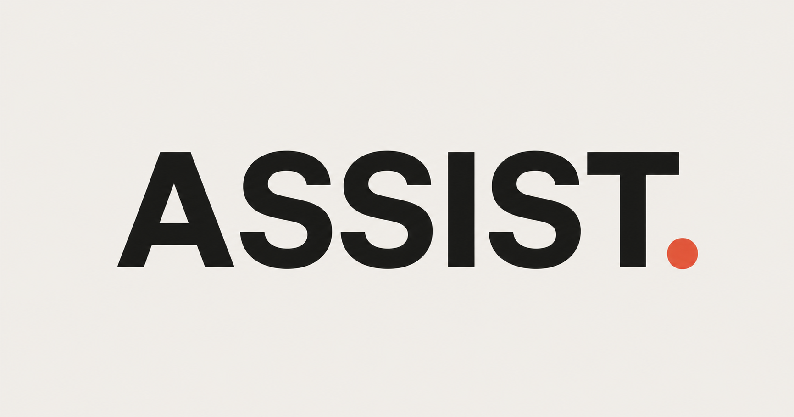
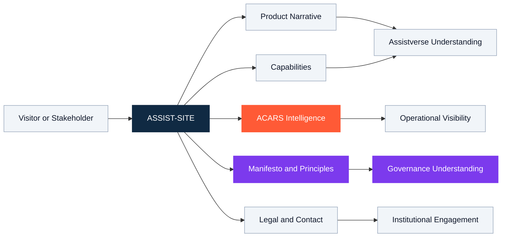
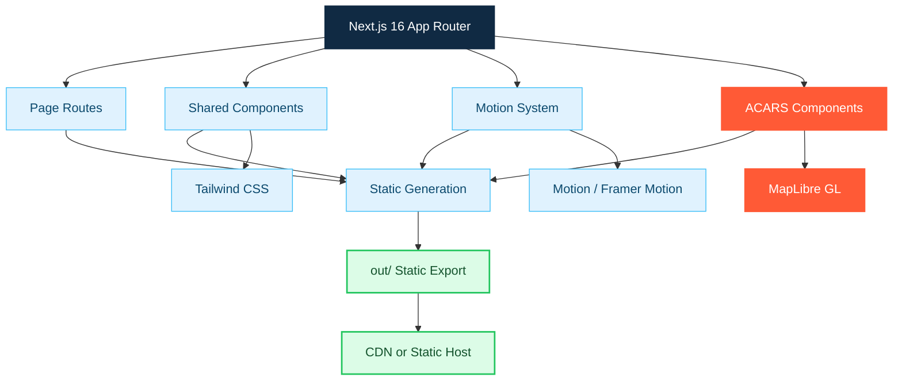

<!--
  ASSISTVERSE / ASSIST-SITE
  Sentra Artificial Intelligence
  GitHub-compatible README — Sentra opening-box style
-->

> [!WARNING]
> **Active prototype — not production-ready.** Content, routes, interfaces, and deployment assumptions may change without notice. This repository must not be treated as a clinical system, patient-care application, or production deployment without formal technical, security, legal, and governance review.

<table width="100%">
  <tr>
    <td width="34%" align="center" valign="middle">
      <a href="https://ferdiiskandar.com">
        
      </a>
      <br /><br />
      <strong>ASSISTVERSE</strong>
      <br /><br />
      
      
      <br /><br />
      <strong>Sentra Artificial Intelligence</strong>
      <br />
      <sub>Clinical Intelligence Division</sub>
      <br /><br />
      <a href="https://ferdiiskandar.com"><sub>ferdiiskandar.com</sub></a>
    </td>
    <td width="66%" valign="middle">
      <h1>ASSISTVERSE // THE PUBLIC FACE</h1>
      <hr />
      <p><strong><em>Built for clinical workflows, not generic AI.</em></strong></p>
      <p><sub><strong>Operational signal:</strong> Kediri, Indonesia · UTC+7 · static export · active construction</sub></p>
      <br />
      <p>
        <strong>Sentra Artificial Intelligence</strong><br />
        Assistverse is the public-facing product environment for Sentra's clinical-intelligence work.
        This repository contains the product site, capability narrative, ACARS intelligence surface,
        manifesto, operating principles, contact experience, and legal pages.
      </p>
      <p><strong>One architecture. One boundary: clinicians decide.</strong></p>
      <br />
      <p>
        
        
        
        
        
        
      </p>
    </td>
  </tr>
</table>

<p align="center">
  
  
  
  
  
</p>

<p align="center">
  <a href="#quick-start">Quick Start</a> ·
  <a href="#product-scope">Product Scope</a> ·
  <a href="#architecture">Architecture</a> ·
  <a href="#repository-structure">Repository</a> ·
  <a href="#governance-and-safety">Governance</a> ·
  <a href="#contribution-contract">Contributing</a>
</p>


## Command Index

<details>
<summary><strong>Open repository navigation</strong></summary>

- [01 — Executive Brief](#01--executive-brief)
- [02 — Identity Architecture](#02--identity-architecture)
- [03 — Mission and Product Doctrine](#03--mission-and-product-doctrine)
- [04 — Product Surface](#04--product-surface)
- [05 — Route Map](#05--route-map)
- [06 — System Architecture](#06--system-architecture)
- [07 — Technology Stack](#07--technology-stack)
- [08 — Repository Structure](#08--repository-structure)
- [09 — Quick Start](#09--quick-start)
- [10 — Development Operations](#10--development-operations)
- [11 — Static Export and Deployment](#11--static-export-and-deployment)
- [12 — Motion System](#12--motion-system)
- [13 — ACARS Intelligence Surface](#13--acars-intelligence-surface)
- [14 — Design and Content Doctrine](#14--design-and-content-doctrine)
- [15 — Accessibility](#15--accessibility)
- [16 — Performance](#16--performance)
- [17 — Metadata and Discoverability](#17--metadata-and-discoverability)
- [18 — Security, Privacy, and Clinical Governance](#18--security-privacy-and-clinical-governance)
- [19 — Contributor and Agent Contract](#19--contributor-and-agent-contract)
- [20 — Validation Matrix](#20--validation-matrix)
- [21 — Definition of Done](#21--definition-of-done)
- [22 — Known Constraints](#22--known-constraints)
- [23 — Release Discipline](#23--release-discipline)
- [24 — Documentation Policy](#24--documentation-policy)
- [25 — Contact and Stewardship](#25--contact-and-stewardship)
- [26 — License](#26--license)

</details>

---

## 01 — Executive Brief

**ASSIST-SITE** is the official public website repository for **Assistverse**, a clinical intelligence product environment developed by **Sentra Artificial Intelligence** for Indonesian primary-care settings, including **FKTP** and **Puskesmas**.

The repository provides the public product narrative, capability architecture, ACARS intelligence experience, manifesto, operating principles, institutional contact surface, and legal pages for Assistverse.

The application uses **Next.js 16 App Router** and is built as a **fully static export**. The deployable artifact is generated in `out/` and can be hosted on a CDN or static hosting service without a persistent Node.js production runtime.

### Primary repository outcomes

| Outcome | Repository responsibility |
|---|---|
| Product understanding | Explain what Assistverse is, why it exists, and where its authority stops |
| Capability communication | Present the product’s six capability pillars to clinical, institutional, technical, and policy stakeholders |
| Operational visibility | Demonstrate ACARS alert, audit, reporting, performance, and geospatial intelligence concepts |
| Governance communication | Publish the product manifesto, principles, privacy position, and terms |
| Institutional engagement | Provide a clear public contact and partnership pathway |
| Deployability | Produce a portable static artifact suitable for CDN distribution |

### One-line position

> **Assistverse is the public face of Sentra’s workflow-native clinical intelligence architecture: designed to surface risk, strengthen operational awareness, and preserve clinician authority.**

---

## 02 — Identity Architecture

The names in this repository refer to different layers and must not be used interchangeably.

| Layer | Canonical name | Meaning |
|---|---|---|
| Product | **Assistverse** | The clinical intelligence product environment and public product identity |
| Developer | **Sentra Artificial Intelligence** | The organization responsible for product architecture, research, engineering, and governance |
| Repository | **ASSIST-SITE** | The source repository for the public Assistverse website |
| Repository slug | `assist-site` | Git clone and local working-directory identifier |
| Public domain | Indonesian primary care | FKTP, Puskesmas, and related healthcare stakeholders |
| Intelligence surface | **ACARS** | Automatic Clinical Alert and Reporting System experience |
| Delivery model | Static web export | CDN-ready output generated in `out/` |

### Naming rules

Use:

```text
Assistverse                         Product and brand
Sentra Artificial Intelligence     Developer and steward
ASSIST-SITE                         Repository and public website codebase
ACARS                               Operational intelligence experience
```

Avoid:

```text
Sentra Assist                      Previous or incorrect product naming in this repository
SideLab                            Separate product; not the identity of ASSIST-SITE
Assist                             Use only when referring to a specific approved sub-product or asset
Autonomous doctor                  Incorrect and unsafe positioning
```

---

## 03 — Mission and Product Doctrine

Primary-care teams operate under constrained consultation time, heterogeneous data quality, fragmented digital workflows, and uneven access to structured clinical intelligence. Assistverse exists to communicate and support a product direction in which important clinical and operational signals become easier to see, interpret, audit, and escalate.

### Mission

Assistverse is designed around five outcomes:

1. **Surface clinical risk earlier** by making red flags and escalation signals more visible.
2. **Reduce cognitive and administrative friction** through structured, workflow-aware intelligence.
3. **Support timely escalation and referral** without transferring professional authority to software.
4. **Improve operational visibility** through audit-oriented reporting and geospatial intelligence.
5. **Preserve trust and sovereignty** through explicit governance, evidence discipline, and controlled deployment.

### Product doctrine

| Principle | Operational meaning |
|---|---|
| **Do no harm** | Safety outranks speed, convenience, visual novelty, and feature count |
| **Clinicians decide** | Licensed professionals retain authority over diagnosis, treatment, referral, and escalation |
| **Evidence before assertion** | Clinical claims must be grounded, traceable, and appropriately qualified |
| **Fail closed** | Missing evidence must not be transformed into fabricated certainty |
| **Workflow native** | Intelligence should reduce friction inside the real operational workflow |
| **Minimum necessary scope** | Collect, process, and display only what the defined purpose requires |
| **Audit first** | Important outputs, state changes, and escalation events should remain reviewable |
| **Accessibility by default** | Motion, contrast, language, and interaction patterns must remain usable |
| **Sovereign deployment** | Architecture should preserve institutional control and local governance |

### Product boundary

| Assistverse is | Assistverse is not |
|---|---|
| A clinical decision-support and operational intelligence environment | An autonomous physician replacement |
| A mechanism for surfacing risk and escalation signals | A source of unsupervised clinical orders |
| A public product and governance communication layer | A guarantee of diagnosis, prognosis, or treatment outcome |
| An audit-oriented visibility surface | A substitute for institutional policy or professional accountability |
| Designed for Indonesian primary-care realities | A generic consumer-health chatbot |

---

## 04 — Product Surface

ASSIST-SITE communicates Assistverse through six major experience areas.

### 4.1 Product landing experience

A motion-led introduction to Assistverse, its clinical purpose, value proposition, and relationship to Sentra Artificial Intelligence.

### 4.2 Capability architecture

A structured presentation of the product’s six capability pillars for clinical, institutional, technical, and policy audiences.

### 4.3 ACARS intelligence dashboard

The **Automatic Clinical Alert and Reporting System** experience communicates operational intelligence concepts such as:

- clinical alert visibility,
- audit-oriented event presentation,
- performance reporting,
- geographic and facility-level intelligence,
- and system-level situational awareness.

### 4.4 Product manifesto

A public statement of why Assistverse exists, the healthcare problems it addresses, and the boundaries it must not cross.

### 4.5 Operating principles

A governance-oriented explanation of the safety, accountability, evidence, accessibility, and engineering principles behind the product.

### 4.6 Institutional communication

Contact, privacy, and terms pages provide the public interface for stakeholders evaluating or engaging with Assistverse.

---

## 05 — Route Map

| Route | Experience | Purpose |
|---|---|---|
| `/` | Home | Motion-driven product introduction and strategic overview |
| `/capabilities` | Capabilities | Presentation of the six Assistverse capability pillars |
| `/acars` | ACARS | Alert, audit, reporting, performance, and geospatial intelligence experience |
| `/manifesto` | Manifesto | Product mission, philosophy, and strategic intent |
| `/principles` | Principles | Clinical AI operating doctrine and governance boundaries |
| `/contact` | Contact | Inquiry, partnership, and institutional engagement interface |
| `/privacy` | Privacy Policy | Public explanation of data-handling commitments |
| `/terms` | Terms of Service | Terms, limitations, and usage conditions |

### Route ownership rule

Every page must have one clear responsibility. New routes should not duplicate an existing page’s purpose merely to accommodate alternate copy, experimental visual treatments, or agent-generated ideas.

---

## 06 — System Architecture

### Public experience flow



### Build and delivery flow



### Runtime boundary

The production artifact is a static export. Therefore:

- no persistent Node.js application server is required after build,
- production API routes are not available within the exported application,
- runtime secrets must not be embedded in client-side bundles,
- dynamic form submission requires an approved external endpoint,
- and environment-dependent behavior must remain compatible with static generation.

---

## 07 — Technology Stack

| Concern | Technology | Responsibility |
|---|---|---|
| Framework | **Next.js 16 — App Router** | Routing, metadata, static generation, and application composition |
| Interface | **React 19** | Component rendering and interactive behavior |
| Language | **TypeScript 5** | Static type safety and maintainable contracts |
| Styling | **Tailwind CSS 3** | Utility-first layout, responsive styling, and design consistency |
| Motion | **Motion / Framer Motion** | Reveal, transition, stagger, mask, and parallax behavior |
| Smooth scrolling | **Lenis** | Controlled native-feel scrolling experience |
| Maps | **MapLibre GL** | Geospatial presentation for the ACARS intelligence layer |
| Output | **Next.js static export** | Generation of the deployable `out/` directory |
| Hosting model | **CDN / static host** | Runtime-independent distribution of the exported site |

### Technology selection principle

A dependency must solve a repository-level requirement that cannot be met safely and clearly with the current stack. New packages require explicit review because every dependency adds maintenance, security, bundle-size, and compatibility cost.

---

## 08 — Repository Structure

```text
assist-site/
├── app/                          # Next.js App Router pages
│   ├── page.tsx                  # Home / landing page
│   ├── layout.tsx                # Root layout, providers, global shell
│   ├── globals.css               # Global styles and shared visual foundations
│   ├── acars/
│   │   └── page.tsx              # ACARS intelligence dashboard
│   ├── capabilities/
│   │   └── page.tsx              # Six capability pillars
│   ├── contact/
│   │   └── page.tsx              # Contact and partnership interface
│   ├── manifesto/
│   │   └── page.tsx              # Product manifesto
│   ├── principles/
│   │   └── page.tsx              # Operating principles
│   ├── privacy/
│   │   └── page.tsx              # Privacy policy
│   └── terms/
│       └── page.tsx              # Terms of service
├── components/
│   ├── SiteHeader.tsx            # Primary navigation header
│   ├── SiteFooter.tsx            # Global footer
│   ├── SideRail.tsx              # Side navigation rail
│   ├── SmoothScroll.tsx          # Lenis smooth-scroll wrapper
│   ├── SubmitButton.tsx          # Form submission control
│   ├── acars/                    # ACARS visualization and dashboard components
│   ├── motion/                   # Reusable motion primitives
│   │   ├── MaskWipe.tsx
│   │   ├── MotionProvider.tsx
│   │   ├── Parallax.tsx
│   │   ├── Reveal.tsx
│   │   ├── SplitText.tsx
│   │   └── Stagger.tsx
│   └── terminal/                 # Terminal-style interface components
├── docs/                         # Internal documentation
├── public/
│   ├── readme-assistverse-header.svg
│   └── ...                       # Favicons, OG assets, manifest, static media
├── next.config.ts                # Next.js and static-export configuration
├── tailwind.config.ts            # Tailwind configuration
├── package.json                  # Scripts and dependencies
├── tsconfig.json                 # TypeScript configuration
└── README.md                     # Repository operating brief
```

### Structural discipline

- Keep route-specific code close to the route.
- Keep reusable motion behavior inside `components/motion/`.
- Keep ACARS-specific components inside `components/acars/`.
- Do not create a new abstraction until at least two real consumers require it.
- Do not move files solely to satisfy aesthetic preferences.
- Do not introduce cross-product code into ASSIST-SITE without an explicit architecture decision.

---

## 09 — Quick Start

### Prerequisites

Use a supported Node.js environment compatible with the repository’s declared Next.js version and package lock.

Recommended local tools:

- Node.js
- npm
- Git
- a modern browser
- an editor with TypeScript support

### Clone and install

```bash
git clone https://github.com/drcodie/assist-site.git
cd assist-site
npm install
```

For a reproducible clean installation in environments where the lockfile is authoritative:

```bash
npm ci
```

### Environment file

Create a local environment file only when the repository requires local configuration.

#### macOS / Linux

```bash
cp .env.example .env.local
```

#### Windows PowerShell

```powershell
Copy-Item .env.example .env.local
```

Do not commit `.env.local` or any real credentials.

### Start development

```bash
npm run dev
```

Open:

```text
http://localhost:3000
```

### Build the static export

```bash
npm run build
```

Expected output:

```text
out/
```

---

## 10 — Development Operations

### Standard commands

```bash
# Install dependencies
npm install

# Start the development server
npm run dev

# Run TypeScript validation
npm run typecheck

# Run linting
npm run lint

# Build the static export
npm run build
```

### Minimum local validation sequence

```bash
npm run typecheck
npm run lint
npm run build
```

A completion claim is invalid when one of these commands has not been run, fails, or is silently skipped.

### Recommended working loop

```text
1. Confirm task scope.
2. Inspect the current implementation.
3. Change the smallest necessary surface.
4. Verify the affected route visually.
5. Run typecheck.
6. Run lint.
7. Run the production build.
8. Review the final diff.
9. Report evidence, limitations, and residual risk.
```

---

## 11 — Static Export and Deployment

### Build artifact

The canonical deployment artifact is:

```text
out/
```

Deploy the contents of `out/` to a static host or CDN. Do not deploy the source directory as though it were the final production artifact.

### Deployment model


### Pre-deployment gate

Before deployment, confirm:

- `npm run typecheck` passes,
- `npm run lint` passes,
- `npm run build` passes,
- all expected routes are present in the export,
- navigation works from the intended hosting base path,
- static assets resolve correctly,
- no credentials or internal-only data are present,
- legal and clinical boundary language is current,
- and a human reviewer has approved the public release.

### Contact form boundary

The current site does not provide an internal production backend for contact submission. A working contact flow requires an explicitly approved external endpoint or service. Never place private service credentials in public client-side code.

---

## 12 — Motion System

All reusable animation primitives live in `components/motion/` and wrap Motion / Framer Motion behavior.

| Component | Behavior | Appropriate use |
|---|---|---|
| `Reveal` | Fade and positional reveal on entry | Section titles, cards, supporting copy |
| `SplitText` | Character-level or word-level stagger | High-emphasis display typography only |
| `Stagger` / `StaggerItem` | Sequenced reveal for grouped content | Capability lists and card collections |
| `Parallax` | Scroll-driven positional offset | Decorative layers with strict restraint |
| `MaskWipe` | Clip-path or mask reveal | Hero imagery and intentional transitions |
| `MotionProvider` | Application-level motion context | Shared motion configuration and lifecycle |

### Motion doctrine

Motion must:

- clarify hierarchy,
- support orientation,
- preserve reading continuity,
- remain deterministic,
- and degrade safely when reduced motion is requested.

Motion must not:

- delay access to critical content,
- conceal essential information,
- create vestibular discomfort,
- become the primary meaning carrier,
- or reduce page usability on low-powered devices.

### Reduced motion

The application respects `prefers-reduced-motion` through the existing reduced-motion handling. New animation work must preserve that behavior.

---

## 13 — ACARS Intelligence Surface

**ACARS — Automatic Clinical Alert and Reporting System** is the operational intelligence surface presented by ASSIST-SITE.

### Communication scope

The public experience may communicate:

| Domain | Public-facing representation |
|---|---|
| Alerts | Visibility of clinically relevant or operationally important events |
| Audit | Reviewable activity and event chronology |
| Reporting | Structured performance and operational summaries |
| Geospatial intelligence | Geographic and facility-level views using MapLibre GL |
| Situational awareness | System-level patterns and service visibility |

### Non-negotiable boundary

The public ACARS presentation must never imply that a demonstration dashboard is a validated production clinical system. Mock, synthetic, or demonstration data must be clearly distinguishable from real patient or facility data.

### Data handling rule

Do not introduce patient-identifiable, confidential institutional, or real operational data into the public repository or exported website.

---

## 14 — Design and Content Doctrine

The README and website should feel like a Sentra system: disciplined, high-signal, operational, and unmistakably authored rather than template-generated.

### Visual language

| Signal | Meaning |
|---|---|
| Deep navy / near-black | System authority, technical depth, and command-center framing |
| White | Clarity and readable foreground hierarchy |
| Red orange | Strategic emphasis and clinical urgency |
| Blue | Clinical intelligence and system structure |
| Green | Verified, available, or healthy state |
| Purple | Audit, governance, or controlled intelligence mode |
| Grey | Metadata labels and secondary operational context |

### Opening-box rule

Every major Sentra repository README should begin with a strong identity frame containing:

- product or system identity,
- developer or origin identity,
- one strategic positioning line,
- an operational signal,
- and compact status metadata.

A generic centered logo followed by badges is not a substitute for the opening box.

### Content hierarchy

Use this sequence:

```text
Identity → purpose → boundaries → capabilities → architecture → operation → governance
```

### Copy rules

- Prefer specific nouns and verbs over generic AI language.
- Do not call a feature “intelligent” unless the mechanism and purpose are clear.
- Do not overstate clinical validation, production status, or regulatory readiness.
- Keep clinical boundary language visible, not hidden in legal pages.
- Distinguish shipped behavior from concept, prototype, and future direction.
- Use **Assistverse** consistently as the product name.

---

## 15 — Accessibility

Accessibility is a release requirement, not a final cosmetic pass.

### Baseline requirements

- Semantic page structure and heading order
- Keyboard-accessible navigation and controls
- Visible focus states
- Meaningful image alternative text
- Sufficient text and control contrast
- Reduced-motion support
- Clear labels for forms and interactive elements
- No information encoded by color alone
- Responsive layouts that preserve reading order

### Motion accessibility

When reduced motion is requested:

- remove or minimize nonessential transitions,
- avoid parallax movement,
- avoid long stagger sequences,
- preserve content visibility,
- and keep navigation response immediate.

### Review expectation

Visual review should include at minimum:

```text
Desktop light theme
Desktop dark theme where relevant
Narrow mobile viewport
Keyboard-only navigation
Reduced-motion preference
High zoom or enlarged text
```

---

## 16 — Performance

The site should remain visually expressive without turning presentation into operational cost.

### Performance priorities

1. Keep initial route payloads controlled.
2. Load heavy geospatial functionality only where needed.
3. Optimize static imagery and social-preview assets.
4. Avoid duplicate animation libraries or overlapping scroll systems.
5. Prevent unnecessary client components.
6. Preserve static-generation compatibility.
7. Treat third-party scripts as exceptional, not default.

### MapLibre boundary

MapLibre GL adds meaningful bundle weight to the ACARS route. Changes to map features should be evaluated for route-specific loading, asset weight, interaction cost, and mobile behavior.

### Performance review questions

- Does this change increase the initial JavaScript payload?
- Can the behavior remain server-rendered or statically generated?
- Is the asset required above the fold?
- Is a new dependency justified by actual user value?
- Does animation remain smooth on ordinary hardware?
- Does the page remain usable before enhancement code completes?

---

## 17 — Metadata and Discoverability

Public pages should provide accurate and consistent metadata.

### Required metadata concerns

- page title,
- page description,
- canonical URL strategy,
- Open Graph title and description,
- Open Graph image,
- social-card compatibility,
- favicon and web manifest,
- and meaningful link-preview text.

### Metadata doctrine

Metadata must describe the page that actually exists. Do not use exaggerated medical, regulatory, or product claims to improve click-through rate.

### Asset ownership

Static metadata assets belong in `public/`. Keep filenames stable when external previews or institutional materials depend on them.

---

## 18 — Security, Privacy, and Clinical Governance

### Security baseline

- Never commit credentials, API keys, tokens, private endpoints, or production secrets.
- Assume all static client assets and bundles are publicly inspectable.
- Review third-party dependencies before introduction.
- Do not render unsanitized external HTML.
- Do not expose internal repository paths, staff-only notes, or confidential architecture details.
- Keep public forms behind approved endpoints with appropriate abuse protection.

### Privacy baseline

- Do not place real patient data in source code, examples, screenshots, fixtures, or static JSON.
- Do not publish personally identifiable health information.
- Use clearly marked synthetic or demonstration data for public visualization.
- Collect only the minimum data required for a defined contact or analytics purpose.
- Document any external data processor before deployment.

### Clinical-governance baseline

Any public clinical claim should be reviewed for:

| Review dimension | Required question |
|---|---|
| Evidence | Is the statement supported and appropriately qualified? |
| Authority | Does the wording preserve clinician accountability? |
| Scope | Is the claim limited to the actual product behavior? |
| Safety | Could a reader interpret the copy as direct medical advice? |
| Validation | Does the statement imply testing or certification that has not occurred? |
| Audit | Can the origin and approval of the statement be traced? |

### Public-release prohibition

Do not publish:

- patient-level real data,
- unreviewed diagnostic claims,
- fabricated performance metrics,
- unsupported outcome claims,
- implied regulatory approval,
- or language suggesting autonomous clinical authority.

---

## 19 — Contributor and Agent Contract

This repository may be edited by human contributors and AI-assisted engineering agents. The same scope, evidence, and validation requirements apply to both.

### Core contract

```text
Touch only what the task requires.
Use Assistverse as the canonical product identity.
Preserve the existing architecture unless change is explicitly authorized.
Do not introduce dependencies without review.
Do not invent clinical, technical, or operational facts.
Do not claim completion without validation evidence.
```

### Before editing

1. Read this README and the relevant source files.
2. Confirm the active repository and working directory.
3. Inspect the current implementation before proposing replacement.
4. Identify the smallest safe change surface.
5. State assumptions when repository evidence is incomplete.

### During editing

- Preserve existing user-visible behavior unless the task requires change.
- Match established typography, motion, spacing, and interaction conventions.
- Avoid broad cleanup during a narrow feature or defect task.
- Do not rename routes, components, or product terms casually.
- Keep static-export compatibility intact.
- Do not add real clinical or institutional data.

### After editing

- Review the diff.
- Run typecheck.
- Run lint.
- Run the production build.
- Verify affected routes in a browser.
- Report what changed, what was tested, and what remains uncertain.

### Prohibited agent behavior

- Selecting a similarly named but incorrect repository
- Replacing working UI because another design appears cleaner
- Removing features under an undocumented simplification rationale
- Adding compatibility paths that weaken safety or evidence boundaries
- Inventing test results, screenshots, metrics, or deployment status
- Expanding task scope without authorization
- Treating a prototype label as evidence of production readiness

---

## 20 — Validation Matrix

| Validation | Command or method | Required before completion |
|---|---|---|
| Type safety | `npm run typecheck` | Yes |
| Lint quality | `npm run lint` | Yes |
| Production build | `npm run build` | Yes |
| Static artifact | Inspect `out/` | Yes for release work |
| Route integrity | Open affected routes in browser | Yes |
| Responsive behavior | Desktop and mobile viewport review | Yes for UI changes |
| Motion behavior | Normal and reduced-motion review | Yes for animation changes |
| Accessibility | Keyboard, focus, labels, contrast | Yes for interaction changes |
| Asset integrity | Verify images, icons, OG assets, and relative paths | Yes |
| Clinical copy | Governance review of clinical claims | Yes when clinical wording changes |
| Privacy | Confirm absence of real sensitive data | Always |
| Diff scope | Review changed files against authorization | Always |

### Completion evidence format

A valid completion report should identify:

```text
Changed files
Behavior changed
Behavior intentionally unchanged
Commands executed
Pass/fail results
Visual routes inspected
Known limitations
Residual risk
```

---

## 21 — Definition of Done

A task is done only when all applicable conditions are true.

### Implementation

- The requested behavior exists.
- The change is limited to the authorized scope.
- Existing relevant behavior is preserved.
- No accidental product renaming or architecture drift is introduced.

### Quality

- Typecheck passes.
- Lint passes.
- Production build passes.
- Affected routes are visually reviewed.
- Responsive behavior remains acceptable.
- Reduced-motion behavior remains safe where relevant.

### Safety and governance

- No real patient or confidential institutional data is added.
- Clinical language remains qualified and accountable.
- No unsupported performance or validation claim is introduced.
- Public and internal boundaries remain explicit.

### Delivery

- The final diff is reviewed.
- Documentation is updated when behavior changes.
- Completion evidence is reported honestly.
- Known limitations are stated rather than concealed.

---

## 22 — Known Constraints

| Constraint | Current implication |
|---|---|
| Static export only | No server-side rendering or production API routes inside the exported site |
| MapLibre GL bundle weight | ACARS mapping adds significant route-specific client weight |
| No internal contact backend | Contact submission requires an approved external endpoint |
| Indonesian-first content | Most public copy is designed primarily for Indonesian stakeholders |
| Prototype status | Product narrative, routes, and interfaces may still evolve |
| Public repository boundary | Real patient and confidential institutional data are prohibited |

### Constraint handling principle

Do not hide a constraint with fragile workarounds. Document it, isolate it, and resolve it only through an explicit architecture decision.

---

## 23 — Release Discipline

### Branching

Use focused branches with names that describe the actual change.

```text
feat/acars-performance-view
fix/mobile-navigation-overflow
docs/assistverse-readme
chore/metadata-assets
```

### Commit messages

Prefer scoped, evidence-oriented commit messages.

```text
feat(acars): add facility performance panel
fix(motion): respect reduced motion in parallax
fix(content): correct Assistverse product identity
docs(readme): restore Sentra opening-box architecture
```

### Pull-request expectations

A pull request should explain:

- the problem,
- the selected solution,
- the change boundary,
- validation evidence,
- screenshots for UI changes,
- and known risk or follow-up work.

### Release gate

A release must not proceed when:

- the build fails,
- required review is absent,
- public copy contains unverified clinical claims,
- sensitive data is present,
- or static assets do not resolve from the deployment target.

---

## 24 — Documentation Policy

Documentation is part of the product contract.

Update the README or relevant internal documentation when a change affects:

- product naming,
- routes,
- build commands,
- deployment behavior,
- repository structure,
- environment requirements,
- clinical boundaries,
- privacy behavior,
- contributor rules,
- or known constraints.

### Documentation quality standard

Documentation must be:

- current,
- specific,
- operationally useful,
- consistent with the source code,
- explicit about uncertainty,
- and free from fabricated status claims.

---

## 25 — Contact and Stewardship

<p>
  <a href="https://ferdiiskandar.com"></a>
  <a href="https://linkedin.com/in/dr-ferdi-iskandar-1b620a3b5"></a>
  <a href="mailto:drferdiiskadar@gmail.com"></a>
</p>

<p>
  <a href="https://discord.gg/1511829076313374745"></a>
  <a href="https://medium.com/@codieverse"></a>
  <a href="https://www.quora.com/profile/drferdiiskadar@gmail.com"></a>
  <a href="https://www.reddit.com/user/SixCupaCoffee"></a>
  <a href="https://www.tiktok.com/@drferdii"></a>
  <a href="https://x.com/ClaudesyI81047"></a>
</p>

### Stewardship

| Responsibility | Steward |
|---|---|
| Product direction | Sentra Artificial Intelligence |
| Clinical product boundary | Authorized clinical leadership and governance reviewers |
| Repository architecture | ASSIST-SITE maintainers |
| Public release approval | Designated technical, clinical, privacy, and governance reviewers |

---

## 26 — License

This repository is distributed under the **MIT License**, subject to the repository’s included license file and any separate restrictions that apply to protected trademarks, confidential assets, clinical data, or third-party materials.

The MIT license does not convert a prototype into a clinically validated, regulated, or production-ready system.

---

<p align="center">
  
  
  
</p>

<p align="center">
  <strong>From Indonesia, for a more equitable world of healthcare.</strong>
  <br />
  <sub>Assistverse · Sentra Artificial Intelligence · Kediri, Indonesia · UTC+7</sub>
  <br /><br />
  <a href="https://ferdiiskandar.com">ferdiiskandar.com</a>
</p>
