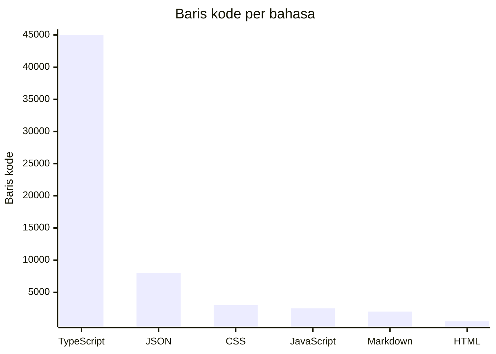

# Angka-angka

Data dikumpulkan pada 2026-06-26.

## Ukuran

| Metrik                | Nilai                             |
| --------------------- | --------------------------------- |
| Total file TypeScript | ~180                              |
| Total file sumber     | ~220                              |
| File pengujian        | ~45                               |
| File konfigurasi      | ~15                               |
| Jumlah paket          | 1 (paket tunggal, bukan monorepo) |

## Aktivitas

Aktivitas commit terbaru (30 hari terakhir):

| Tanggal    | Commit   | Deskripsi                                                                                                  |
| ---------- | -------- | ---------------------------------------------------------------------------------------------------------- |
| 2026-06-26 | 90b7bbce | chore(sentra-assist): pindahkan file dan direktori tidak terpakai ke folder arsip                          |
| 2026-06-26 | 3979f20a | fix(sentra-assist): implementasikan Pilar 1 Chronic Preservation untuk ekstraksi dosis historis yang tepat |
| 2026-06-25 | dced727a | feat(diagnosis): tambahkan parameter opsional trajectoryResult ke runGetSuggestionsFlow                    |
| 2026-06-25 | 407200c4 | feat(diagnosis): hubungkan feature flags ke get-suggestions-flow                                           |
| 2026-06-25 | 07d64f20 | feat(diagnosis): hubungkan feature flags ke llm-reasoner                                                   |

## Kompleksitas

| Metrik                               | Nilai                                                   |
| ------------------------------------ | ------------------------------------------------------- |
| File terbesar                        | `components/clinical/TTVInferenceUI.tsx` (~3.300 baris) |
| File logika terbesar                 | `lib/clinical/vital-guardrails.ts` (~822 baris)         |
| Kedalaman nesting direktori terdalam | 4 tingkat (`components/clinical/trajectory/v2/`)        |
| Simbol yang diekspor                 | ~150+ di lib/ dan components/                           |

## Commit yang diatribusikan bot

Tidak ada commit bot yang terdeteksi dalam sejarah terbaru. Semua commit ditulis
oleh dr. Ferdi Iskandar (ferdiiskandar).

## Halaman terkait

- [Ikhtisar](overview/index.md) — Pengenalan proyek
- [Lore](lore.md) — Sejarah dan garis waktu basis kode
