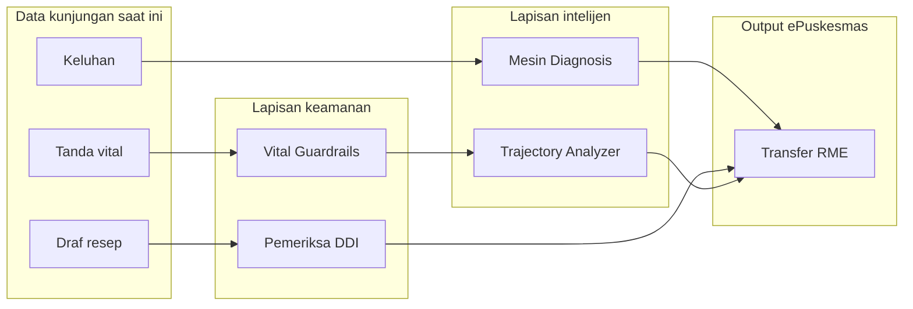

# Ikhtisar fitur

Sentra Assist dilengkapi dengan lima area fitur yang terintegrasi erat.
Masing-masing dirancang untuk mengurangi beban kognitif klinisi yang bekerja di
dalam ePuskesmas sambil menjadikan keselamatan pasien sebagai pusat.

## Area fitur

| Area                                        | Apa yang dilakukan                                                                | Titik masuk kunci                                       |
| ------------------------------------------- | --------------------------------------------------------------------------------- | ------------------------------------------------------- |
| [Keamanan klinis](clinical-safety.md)       | Pengaman multi-lapisan yang mencegat data tidak aman sebelum mencapai rekam medis | `lib/clinical/vital-guardrails.ts`                      |
| [Keamanan obat](drug-safety.md)             | Pemeriksaan DDI real-time, penalaran terapi, dan perhitungan dosis                | `lib/iskandar-diagnosis-engine/ddi-checker.ts`          |
| [Transfer RME](rme-transfer.md)             | Transfer data rujukan terorkestrasi ke formulir ePuskesmas                        | `lib/rme/transfer-orchestrator.ts`                      |
| [Trajektori klinis](clinical-trajectory.md) | Pemantauan pasien longitudinal hingga lima kunjungan                              | `lib/iskandar-diagnosis-engine/trajectory-analyzer.ts`  |
| Mesin diagnosis                             | Alur saran deterministik-first dengan penataan ulang LLM opsional                 | `lib/iskandar-diagnosis-engine/get-suggestions-flow.ts` |

Mesin diagnosis didokumentasikan di bagian
[sistem](../systems/diagnosis-engine.md) karena arsitekturnya menjangkau seluruh
ekstensi. Empat halaman di atas berfokus pada fitur yang berinteraksi langsung
dengan klinisi.

## Cara area saling terhubung

Data mengalir dari kunjungan saat ini ke lapisan keamanan terlebih dahulu. Vital
Guardrails memblokir atau menandai nilai berbahaya sebelum digunakan oleh mesin
diagnosis atau trajectory analyzer. Modul keamanan obat berjalan paralel,
memeriksa setiap baris resep terhadap database DDInter 2.0. Hanya setelah kedua
pemeriksaan keamanan lulus, orchestrator transfer RME mendorong data ke
ePuskesmas.

## Keamanan klinis

Lapisan keamanan adalah bagian paling defensif dari ekstensi. Mencakup:

- **Vital Guardrails** — 822 baris validasi yang memberikan setiap tanda vital
  tingkat keparahan (normal, peringatan, kritis, diblokir). Hard stop mencegah
  pengiriman formulir ketika nilai mengancam jiwa. Soft flag memperingatkan
  tentang nilai yang memerlukan perhatian tetapi tidak segera berbahaya.
  Code-red cues memicu ketika teks gejala mengandung frasa seperti "tidak sadar"
  atau "nyeri dada."
- **SYMPHONY Safety Bridge** — Memetakan hasil analisis trajektori ke peringatan
  CDSS. Ketika trajectory analyzer mendeteksi deteriorasi, SYMPHONY
  menerjemahkan itu menjadi peringatan yang dapat ditindaklanjuti yang dilihat
  klinisi di dalam panel samping.
- **Patient Context Profile** — Klasifikasi pita usia dan kesadaran yang
  mengubah cara guardrails menafsirkan nilai. Nadi 120 adalah normal untuk bayi
  tetapi ditandai untuk dewasa.
- **Anamnesa Composer** — Menghasilkan draf terstruktur dari anamnesa dari
  keluhan bebas teks, riwayat kronis, dan tanda vital. Draf disajikan kepada
  klinisi untuk ditinjau sebelum transfer.

Baca detail lengkap di [clinical-safety.md](clinical-safety.md).

## Keamanan obat

Modul keamanan obat menjaga keputusan resep tetap aman tanpa menambah friksi:

- **DDI Checker** — Pemeriksa offline yang didukung oleh database DDInter 2.0
  (173.071+ interaksi). Dimuat sekali saat startup dan menjawab kueri dalam
  milidetik.
- **Pharmacotherapy Reasoner** — Rekomendasi terapi berbasis sindrom yang
  mencocokkan kode ICD-10 ke aturan intent (antianginal, antiplatelet, glikemik
  primer, dll.).
- **Dosage Calculator** — Dosis berbasis berat untuk pasien pediatrik dan
  geriatrik, mengacu pada IDAI 2024, panduan geriatrik PAPDI, dan PIONAS.
- **Prescription Form Auto-fill (ResepForm)** — Komponen React yang menangkap
  baris resep dan mengirimkannya ke orchestrator transfer RME.

Baca detail lengkap di [drug-safety.md](drug-safety.md).

## Transfer RME

Orchestrator transfer RME mendorong data klinis yang telah selesai ke ePuskesmas
dalam tiga langkah: anamnesa, diagnosa, resep. Setiap langkah memiliki batas
waktu, logika percobaan ulang, dan jendela deduplikasi sendiri. Orchestrator
menggunakan penargetan tab cerdas untuk menemukan tab ePuskesmas yang benar
bahkan ketika klinisi memiliki banyak tab terbuka. Jembatan dashboard
menyelaraskan state antara panel samping ekstensi dan halaman ePuskesmas.

Baca detail lengkap di [rme-transfer.md](rme-transfer.md).

## Trajektori klinis

Analisis trajektori mengubah kunjungan terisolasi menjadi gambaran longitudinal.
Melihat lima kunjungan terakhir dan menghitung arah tren, tingkat risiko, dan
status deteriorasi. Trajectory V2 menambahkan kurva risiko, jalur cakupan
sinyal, dan panel delta kunjungan. Sistem juga mengklasifikasikan penyakit
kronis dan membangun profil skrining tanda vital yang terstratifikasi
berdasarkan usia.

Baca detail lengkap di [clinical-trajectory.md](clinical-trajectory.md).

## Feature flags

Setiap area fitur dapat dikendalikan melalui variabel lingkungan. Flag dibaca
saat build time dan dikompilasi keluar saat dinonaktifkan, sehingga tidak ada
overhead runtime untuk modul yang tidak digunakan. Lihat
[sistem/feature-flags.md](../systems/feature-flags.md) untuk daftar lengkap.

## Halaman terkait

- [Sejarah](../lore.md) — Sejarah evolusi setiap fitur
- [Angka-angka](../by-the-numbers.md) — Metrik ukuran dan kompleksitas basis
  kode
- [Ikhtisar sistem](../systems/index.md) — Dokumentasi arsitektur
