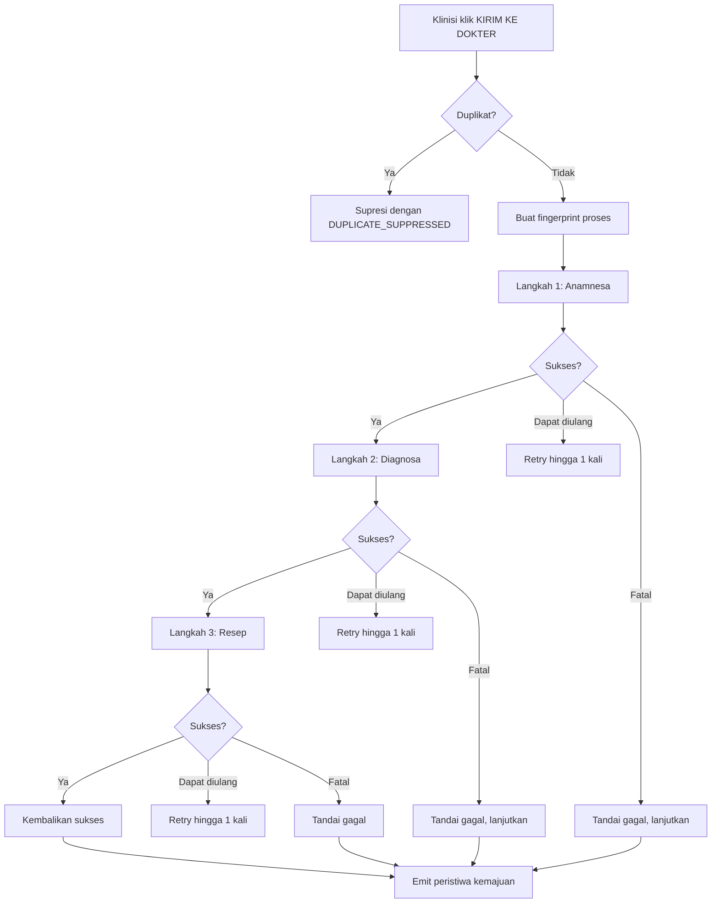

# Transfer RME

Orchestrator transfer RME mendorong data klinis dari panel samping Sentra Assist
ke bidang formulir ePuskesmas yang benar. Menangani tiga langkah (anamnesa,
diagnosa, resep) dengan batas waktu per-langkah, logika percobaan ulang,
deduplikasi, dan penargetan tab cerdas. Tujuannya adalah menghilangkan entri
ganda tanpa pernah menimpa data yang telah ditinjau klinisi.

## Tujuan

Klinisi di layanan kesehatan primer Indonesia menghabiskan porsi signifikan dari
setiap kunjungan untuk mengetik ulang data yang sama ke beberapa layar
ePuskesmas. Modul transfer RME mengotomatisasi ini sambil menghormati batasan
keamanan: hanya mengisi bidang yang kosong atau tidak terkunci, melewati bidang
read-only, dan tidak pernah mengirimkan otomatis. Klinisi selalu melihat
pratinjau sebelum transfer dan dapat membatalkan pada langkah apa pun.

## Tata letak direktori

```
lib/rme/
├── transfer-orchestrator.ts   # Orchestrator inti: dedupe, retry, mesin state
├── transfer-targeting.ts      # Pemilihan tab dan deteksi tipe halaman
├── payload-mapper.ts          # Pemetaan payload klinis → ePuskesmas
├── prognosis-mapper.ts        # Pemetaan trajektori → nilai prognosa
```

## Abstraksi kunci

### `RMETransferOrchestrator`

Kelas stateful yang mengelola satu atau lebih proses transfer. Memelihara:

- `recentFingerprints` — cache deduplikasi yang dikunci oleh hash payload
- `activeRuns` — peta proses yang sedang berlangsung untuk dukungan pembatalan

API publik adalah metode tunggal:

- `run(transferPayload, executeStep, options)` — mengeksekusi urutan langkah dan
  mengembalikan `RMETransferResult`

### `RMETransferResult`

State akhir dari proses transfer:

- `runId` — pengenal unik untuk proses
- `fingerprint` — hash stabil dari payload (digunakan untuk deduplikasi)
- `state` — `success`, `partial`, `failed`, atau `cancelled`
- `totalLatencyMs` — durasi end-to-end
- `reasonCodes` — array kode alasan yang dapat dibaca manusia
- `steps` — hasil per-langkah (`anamnesa`, `diagnosa`, `resep`)

### `RMETransferStepResult`

Detail per-langkah:

- `step` — langkah mana ini
- `state` — `pending`, `running`, `success`, `partial`, `skipped`, `failed`,
  `cancelled`
- `attempt` — upaya percobaan ulang mana yang menghasilkan hasil ini
- `latencyMs` — berapa lama langkah berlangsung
- `successCount`, `failedCount`, `skippedCount` — penghitung tingkat bidang
- `reasonCode` dan `errorClass` — klasifikasi untuk analisis kegagalan
- `message` — ringkasan yang dapat dibaca manusia

### `RMETransferMapperInput`

Input ke `buildRMETransferPayload`. Membawa konteks klinis lengkap: keluhan,
tanda vital, diagnosis, medikasi, trajektori, alergi, status kehamilan, tipe
disabilitas, dan draf anamnesa yang sudah dibangun dari composer.

## Cara kerja

### Alur transfer



### Langkah 1: Deduplikasi

Sebelum panggilan jaringan apa pun, orchestrator menghitung fingerprint stabil
dari payload menggunakan `stableStringify` dan hash FNV-1a. Jika fingerprint
yang sama terlihat dalam jendela deduplikasi (default 7 detik), proses ditekan
dengan kode alasan `DUPLICATE_SUPPRESSED`. Ini mencegah pengisian ganda ketika
klinisi mengklik ganda tombol KIRIM KE DOKTER.

Bidang `no_resep` dinormalisasi ke placeholder stabil selama fingerprinting
sehingga nomor resep yang volatil tidak merusak deduplikasi.

### Langkah 2: Penargetan tab

`transfer-targeting.ts` memilih tab ePuskesmas terbaik untuk setiap langkah.
Fungsi penilaian memberi peringkat kandidat berdasarkan:

- `isEpuskesmas` (+100) — harus domain ePuskesmas
- `active` (+40) — bonus jika tab sedang aktif
- `encounterId` cocok (+80) — URL berisi ID kunjungan saat ini
- `step` URL cocok (+50) — jalur URL cocok dengan alias langkah (mis.,
  `/anamnesa/`, `/diagnosa/`, `/resep/`)
- rute pemeriksaan generik (-30) — penalti untuk rute generik saat menargetkan
  anamnesa, untuk menghindari kebingungan tab SOAP

Jika tidak ada tab yang mencetak di atas nol, orchestrator kembali ke tab aktif.
Jika tab aktif bukan ePuskesmas, langkah gagal dengan `NO_ACTIVE_TAB`.

### Langkah 3: Pemetaan payload

`payload-mapper.ts` membangun tiga payload dari input klinis.

**Payload anamnesa** (`buildAnamnesaPayload`):

- `keluhan_utama` dan `keluhan_tambahan` dari input
- `lama_sakit` dari draf composer anamnesa (durasi yang diurai) atau default 1
  hari
- `is_pregnant` dari pemetaan status kehamilan
- `alergi` dinormalisasi ke bucket obat/makanan/udara/lainnya
- `riwayat_penyakit` dari draf composer atau teks fallback
- `vital_signs` dengan kesadaran AVPU-derived dan perhitungan MAP
- `periksa_fisik` dengan GCS, SpO2, ADL, dan antropometri yang dihasilkan dari
  usia/gender/obesitas
- `assesmen_nyeri` dari skor nyeri atau diinferensi dari teks keluhan
- `resiko_jatuh` dari tingkat kesadaran
- `status_psikososial` dengan default yang masuk akal
- `lainnya` dengan teks perawatan keperawatan yang acak tetapi koheren secara
  klinis
- `keadaan_fisik` dengan aktivasi sistem organ yang didorong gejala dan temuan
  normal
- `anatomi_tubuh` dari pencocokan kata kunci anatomi pada teks keluhan

**Payload diagnosa** (`buildDiagnosaPayload`):

- `icd_x` dan `nama` dari input diagnosis
- `jenis` default ke `PRIMER`
- `kasus` terdeteksi otomatis sebagai `LAMA` jika riwayat kunjungan ada, jika
  tidak `BARU`
- `prognosa` dipetakan dari analisis trajektori jika tersedia, jika tidak
  `Bonam (Baik)`
- `penyakit_kronis` dari klasifikasi penyakit kronis

**Payload resep** (`buildResepPayload`):

- Menyaring medikasi dengan `safety_check === 'contraindicated'`
- Menyelesaikan setiap nama obat terhadap stok lokal menggunakan skoring fuzzy
- Mengklasifikasikan setiap obat ke peran triad `utama`, `adjuvant`, atau
  `vitamin`
- Mengestimasi jumlah dari string dosis dan durasi
- Menormalisasi signa ke format `NxM`
- Memetakan `aturan_pakai` ke nilai enum numerik
- Menghasilkan keterangan dari rasional atau catatan default
- Melacak kelengkapan triad (`RESEP_TRIAD_INCOMPLETE` jika ada peran yang
  hilang)

### Langkah 4: Eksekusi dan retry

Setiap langkah dieksekusi oleh callback `executeStep`, yang disuntikkan oleh
pemanggil (biasanya service worker latar belakang). Callback mengirim pesan ke
skrip konten, yang melakukan pengisian DOM aktual.

Batas waktu default per langkah:

| Langkah  | Batas Waktu |
| -------- | ----------- |
| anamnesa | 45.000 ms   |
| diagnosa | 18.000 ms   |
| resep    | 30.000 ms   |

Jumlah retry default:

| Langkah  | Retry |
| -------- | ----- |
| anamnesa | 1     |
| diagnosa | 1     |
| resep    | 1     |

Jeda retry adalah 900 ms dikalikan dengan nomor upaya (backoff eksponensial
tanpa jitter).

### Langkah 5: Normalisasi hasil

Orchestrator menormalisasi respons mentah dari skrip konten menggunakan
`normalizeExecutionResult`. Menangani beberapa format amplop (`res`, `result`,
`data`, `payload`) dan mengklasifikasikan kesalahan:

- `USER_CANCELLED` — tidak dapat dipulihkan
- `STEP_TIMEOUT` — dapat dipulihkan
- `PAGE_NOT_READY` — dapat dipulihkan
- `NO_ACTIVE_TAB` — dapat dipulihkan
- `FIELD_NOT_FOUND` — dapat dipulihkan
- `NO_FIELDS_FILLED` — dapat dipulihkan
- Read-only / CSRF / protected errors — diturunkan ke `skipped`

Jika semua kesalahan dapat dilewati, state langkah menjadi `skipped` daripada
`failed`. Ini mencegah masalah kunci formulir ePuskesmas yang sementara dari
memblokir seluruh transfer.

### Langkah 6: Pemetaan prognosa

Ketika analisis trajektori tersedia, `mapTrajectoryToPrognosis` dalam
`prognosis-mapper.ts` memilih nilai dropdown prognosa ePuskesmas:

| State trajektori                           | Prognosa             |
| ------------------------------------------ | -------------------- |
| Kritis atau urgensi segera                 | Dubia Ad Malam       |
| Risiko tinggi + deteriorasi                | Malam                |
| Dua atau lebih risiko serangan akut >= 60% | Dubia Ad Malam       |
| Deteriorasi + risiko sedang                | Dubia Ad Sanam/Bonam |
| Membaik + risiko rendah + stabil           | Sanam                |
| Stabil + risiko rendah                     | Bonam                |
| Default                                    | Dubia Ad Sanam/Bonam |

## Titik integrasi

| Konsumen                      | Apa yang diterima          | Bagaimana digunakan                                          |
| ----------------------------- | -------------------------- | ------------------------------------------------------------ |
| Service worker latar belakang | `RMETransferResult`        | Mencatat hasil, memperbarui jembatan dashboard               |
| Skrip konten                  | callback `executeStep`     | Menerima payload dan mengisi DOM                             |
| TTVInferenceUI                | `RMETransferProgressEvent` | Menampilkan bilah kemajuan dan status per-langkah            |
| Mesin diagnosis               | `RMETransferMapperInput`   | Membangun daftar diagnosis dan medikasi yang menjadi payload |
| Trajektori klinis             | `TrajectoryAnalysis`       | Memetakan ke prognosa dan flag penyakit kronis               |

## Titik masuk untuk modifikasi

### Menambahkan langkah transfer baru

1. Tambahkan nama langkah ke `RMETransferStepStatus` dalam `src/utils/types.ts`.
2. Tambahkan ke `DEFAULT_STEP_ORDER` dan default batas waktu/retry dalam
   `transfer-orchestrator.ts`.
3. Tambahkan pembangun payload dalam `payload-mapper.ts`.
4. Tambahkan alias URL dalam `transfer-targeting.ts`.

### Mengubah default batas waktu atau retry

Edit konstanta `DEFAULT_TIMEOUT_MS` dan `DEFAULT_RETRY_BY_STEP` dalam
`transfer-orchestrator.ts`. Ini juga dapat diganti per-proses via
`RMETransferRunOptions`.

### Menambahkan alias medikasi baru

Edit `MEDICATION_NAME_SYNONYMS` dalam `payload-mapper.ts`. Kunci adalah nama
input, nilai adalah nama kanonik ePuskesmas. Resolver stok juga menggunakan
`foldMedicationOrthography` untuk menangani variasi ejaan umum (ph → f, x → ks,
y → i, dll.).

### Mengubah aturan pemetaan prognosa

Edit `mapTrajectoryToPrognosis` dalam `prognosis-mapper.ts`. Fungsi mengevaluasi
kondisi dalam urutan prioritas: state kritis terlebih dahulu, lalu urgensi
darurat, lalu kombinasi risiko tinggi, lalu default stabil. Tambahkan kondisi
baru sebelum fallback akhir.

### Menambahkan kata kunci anatomi baru

Edit `ANATOMY_PAYLOAD_RULES` dalam `payload-mapper.ts`. Setiap aturan memiliki
`bodyPart` dan array `keywords`. Mapper memilih kata kunci yang cocok paling
awal dalam teks keluhan dan menghilangkan duplikat berdasarkan bagian tubuh.

## Halaman terkait

- [Keamanan klinis](clinical-safety.md) — Vital guardrails dan anamnesa composer
  yang memberi makan payload anamnesa
- [Keamanan obat](drug-safety.md) — DDI checker dan ResepForm yang memberi makan
  payload resep
- [Trajektori klinis](clinical-trajectory.md) — Trajectory analyzer yang memberi
  makan pemetaan prognosa
- [Ikhtisar sistem](../systems/index.md) — Dokumentasi arsitektur untuk service
  worker latar belakang dan skrip konten
