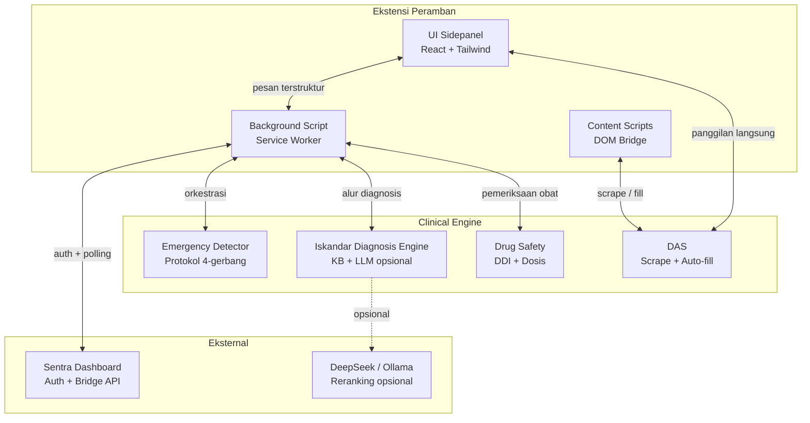
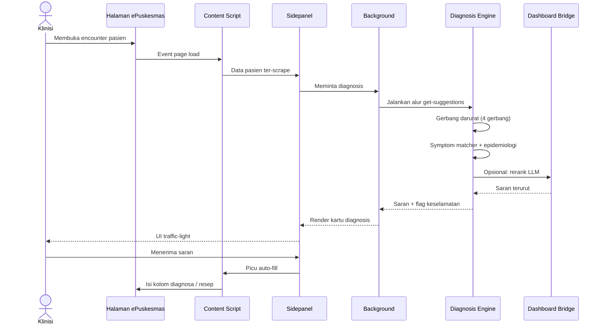
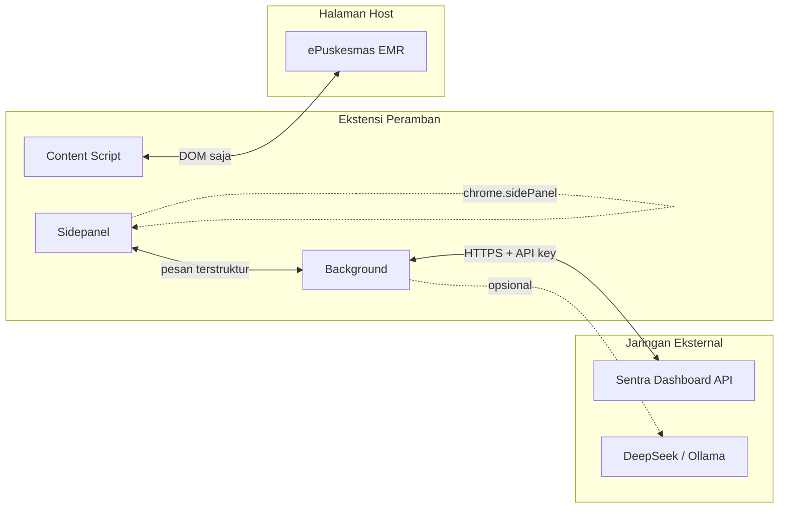

# Arsitektur

Sentra Assist adalah ekstensi peramban Manifest V3 yang dibangun dengan WXT. Ia
menjalankan tiga konteks runtime utama — UI sidepanel React, service worker
background, dan content script yang menjembatani akses ke halaman ePuskesmas.
Seluruh logika klinis berjalan di peramban; panggilan jaringan terbatas pada
autentikasi, polling dashboard bridge, dan reranking LLM opsional.

## Lapis sistem

## Alur data: encounter tipikal

## Konteks runtime

### Sidepanel (`entrypoints/sidepanel/`)

Sidepanel adalah UI yang berhadapan dengan klinisi. Sidepanel ini adalah
sidepanel standar Chrome (API `sidePanel` Manifest V3) yang dirender dengan
React. Tanggung jawab utama:

- Menampilkan konteks pasien dan saran diagnosis
- Merender alert darurat (sistem traffic light)
- Menjadi host untuk clinical workbench (differential diagnosis, visualisasi
  trajectory)
- Memicu aksi auto-fill DAS
- Pengaturan dan UI konfigurasi

Entry point adalah `entrypoints/sidepanel/main.tsx`, yang me-mount
`ApprovedSentraAssistApp.tsx`.

### Background script (`entrypoints/background.ts`)

Background script adalah service worker yang menangani:

- Perutean pesan antara sidepanel, content script, dan offscreen document
- Polling autentikasi magic-link
- Polling dashboard bridge untuk sinkronisasi pasien dan hasil engine kanonik
- Orkestrasi CDSS (mengkoordinasikan alur diagnosis)
- Penjadwalan berbasis Chrome Alarms untuk tugas periodik

### Content scripts (`entrypoints/content.ts`, `entrypoints/inject.content.ts`)

Content script berjalan dalam konteks halaman ePuskesmas:

- `content.ts` — content script standar yang men-scrape data DOM dan
  berkomunikasi dengan background script melalui `@webext-core/messaging`.
- `inject.content.ts` — diinjeksikan ke main world ketika ePuskesmas membutuhkan
  eksekusi main-world untuk manipulasi formulir.

## Manajemen state

State ekstensi dikelola oleh store Zustand (`lib/store.ts`) dengan persistensi
`chrome.storage.local`. Store menyimpan encounter aktif, konteks pasien, saran
diagnosis, dan state UI. Store memiliki TTL 24 jam pada data encounter untuk
mencegah informasi basi.

## Direktori utama

| Direktori      | Tujuan                                                                                 |
| -------------- | -------------------------------------------------------------------------------------- |
| `entrypoints/` | Entry point ekstensi (sidepanel, background, content script, halaman login)            |
| `components/`  | Komponen React yang diorganisasikan berdasarkan domain (clinical, sidepanel, cdss, ui) |
| `lib/`         | Logika bisnis inti: diagnosis engine, emergency detection, API client, scraper         |
| `services/`    | Layanan pengembangan lokal (MedLens ECG harness)                                       |
| `data/`        | Dataset statis: basis data DDI, pemetaan kolom, template anamnesa                      |
| `utils/`       | Utilitas bersama: messaging, storage, logging, audio                                   |
| `types/`       | Definisi tipe TypeScript bersama                                                       |
| `tests/`       | Suite pengujian: unit, integrasi, klinis, e2e                                          |

## Batasan keamanan

- Content script hanya dapat membaca/menulis DOM ePuskesmas. Ia tidak memiliki
  akses jaringan.
- Background script menangani semua panggilan API eksternal. API key disimpan di
  `chrome.storage.local`, tidak pernah di content script.
- Data pasien di-hash dengan SHA-256 (`lib/api/pii-guard.ts`) sebelum permintaan
  jaringan apa pun.
- PII di-mask (`utils/name-masking.ts`) di log dan UI.

## Output build

WXT membangun ekstensi ke dalam `.output/`:

| Perintah                | Output                                           |
| ----------------------- | ------------------------------------------------ |
| `npm run dev`           | `.output/chrome-mv3-dev/` (unpacked, hot reload) |
| `npm run build`         | `.output/chrome-mv3-production/` (produksi)      |
| `npm run build:firefox` | `.output/firefox-mv2-production/`                |
| `npm run zip`           | `.output/chrome-mv3-production.zip` (siap CWS)   |

## Halaman terkait

- [Panduan memulai](getting-started.md) — cara build dan menjalankan secara
  lokal
- [Iskandar Diagnosis Engine](../systems/iskandar-diagnosis-engine.md) —
  pipeline CDSS inti
- [Deteksi darurat](../systems/emergency-detector.md) — protokol keselamatan
  4-gerbang
- [Otomasi formulir DAS](../systems/das-form-automation.md) — adaptive DOM
  scraping dan auto-fill
