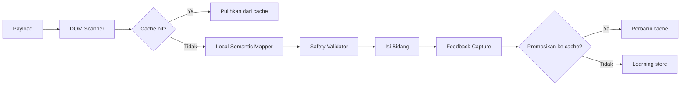

# DAS Form Automation

Data Ascension System (DAS) menyediakan scraping DOM adaptif dan pengisian
formulir otomatis untuk ePuskesmas. Menggantikan selektor hardcoded yang rapuh
dengan pengenalan bidang cerdas yang belajar pola per-fasilitas dan meningkat
seiring waktu.

## Tujuan

Formulir ePuskesmas bervariasi antar instalasi Puskesmas dan berubah tanpa
pemberitahuan. DAS memindai halaman, membangun tanda tangan bidang, memetakannya
ke payload klinis menggunakan pencocokan semantik, dan mengisinya dengan aman.
Ia menyimpan pemetaan yang berhasil dan belajar dari koreksi pengguna sehingga
kunjungan berulang ke fasilitas yang sama menjadi lebih cepat dan lebih akurat.

## Tata letak direktori

```
lib/scraper/adaptive/
├── dom-scanner.ts           # Fase 1: Ekstrak tanda tangan bidang dari halaman
├── field-classifier.ts      # Klasifikasikan bidang untuk keamanan (klinis vs umum)
├── semantic-mapper.ts        # Fase 2: Orchestrator — cache → mapper lokal → keamanan
├── local-semantic-mapper.ts # Pencocokan semantik lokal berbasis heuristik
├── mapping-cache.ts         # Lapisan 1: Cache statis (cepat, offline)
├── safety-validator.ts      # Ambang batas kepercayaan dan pemeriksaan kategori klinis
├── learning-store.ts        # Fase 3: Loop umpan balik IndexedDB
├── feedback-capture.ts      # Lacak hasil pengisian per bidang
├── cache-promoter.ts        # Promosikan pemetaan yang berhasil ke cache
├── types.ts                 # Tipe bersama untuk semua fase DAS
└── index.ts                 # Ekspor publik

lib/filler/
├── filler-core.ts           # Mesin dispatch peristiwa untuk semua tipe bidang
└── main-world-bridge.ts     # Jembatan yang menyadari jQuery untuk AJAX autocomplete

lib/handlers/
├── page-anamnesa.ts         # Handler halaman anamnesa (keluhan, vital, keadaan fisik)
├── page-diagnosa.ts         # Handler halaman diagnosa (ICD-10, jenis, kasus, prognosa)
└── page-resep.ts            # Handler halaman resep (baris medikasi, signa, aturan pakai)
```

## Abstraksi kunci

### `FieldSignature`

Deskripsi lengkap dari bidang formulir: nama tag, selektor, tipe, atribut (nama,
id, placeholder, aria-label), teks label, konteks (ID formulir, header bagian,
label saudara), dan posisi.

### `MappingResult`

Output dari pemetaan DAS: bidang yang cocok dengan skor kepercayaan, kunci
payload yang tidak dipetakan, peringatan, dan latensi. Pemetaan di bawah ambang
batas kepercayaan dikecualikan.

### `ClinicalFieldCategory`

`vital_signs` | `medication` | `allergy` | `patient_id` | `diagnosis` |
`general`. Digunakan oleh safety validator untuk memutuskan bidang mana yang
memerlukan konfirmasi manusia.

### `FillResult`

Hasil per-bidang dari filler: boolean sukses, pengenal bidang, nilai, metode
yang digunakan (`direct` | `autocomplete` | `select` | `checkbox` | `radio`),
dan kesalahan opsional.

## Cara kerja

### Alur DAS



### Fase 1: DOM scanner

`lib/scraper/adaptive/dom-scanner.ts` menghitung semua bidang formulir
interaktif pada halaman. Untuk setiap bidang diekstrak:

- **Klasifikasi tipe** — text, number, select, checkbox, radio, date, time,
  textarea, hidden
- **Selektor unik** — dihitung via ID, nama, atau jalur CSS dengan nth-child
- **Resolusi label** — `<label for>`, label pembungkus, aria-label,
  aria-labelledby, teks berdekatan, atau fallback placeholder
- **Konteks** — ID formulir induk, header bagian terdekat, label saudara, kelas
  CSS induk
- **Posisi** — bounding rect dan visibilitas

Scanner berjalan dalam waktu kurang dari 10ms untuk halaman ePuskesmas tipikal
dan menghasilkan array objek `FieldSignature`.

### Fase 2: Semantic mapper

`lib/scraper/adaptive/semantic-mapper.ts` adalah orchestrator utama.
Mengoordinasikan:

1. **Pencarian cache** — `mapping-cache.ts` memeriksa apakah halaman persis ini
   (berdasarkan URL + hash bidang) pernah dipetakan sebelumnya. Cache hit
   memulihkan pemetaan dalam waktu kurang dari 50ms.
2. **Pemetaan semantik lokal** — `local-semantic-mapper.ts` menggunakan
   heuristik untuk mencocokkan kunci payload ke bidang: kesamaan teks label,
   pencocokan nama/ID, pola spesifik ePuskesmas, dan konteks header bagian.
3. **Validasi keamanan** — `safety-validator.ts` menegakkan ambang batas
   kepercayaan (default 0.8), mengklasifikasikan bidang berdasarkan kategori
   klinis, dan menandai bidang kritis untuk konfirmasi manusia.
4. **Promosi cache** — pemetaan dengan kepercayaan >= 0.9 disimpan dalam cache
   untuk waktu berikutnya.

### Fase 3: Learning store

`lib/scraper/adaptive/learning-store.ts` memelihara database IndexedDB dari
hasil pengisian. Setiap upaya pengisian mencatat:

- Kunci payload, selektor bidang, kepercayaan, hasil (`success` |
  `auto_corrected` | `failed` | `rejected` | `timeout`)
- Tipe halaman (anamnesa, diagnosa, resep, soap)
- ID sesi dan timestamp

Statistik agregat melacak tingkat keberhasilan per pemetaan. Ketika pemetaan
mencapai kriteria promosi (minimum upaya, tingkat keberhasilan, kepercayaan, dan
periode stabilitas), ia dipromosikan ke cache statis.

### Auto-fill: mesin dispatch peristiwa

`lib/filler/filler-core.ts` mengirimkan rantai peristiwa yang benar untuk setiap
tipe bidang:

- **Text / textarea** — focus → input → change → blur
- **Select** — change saja
- **Checkbox** — click → change
- **Radio** — click → change
- **Autocomplete** — focus → simulasikan pengetikan → keydown → tunggu dropdown
  → klik item

Filler menggunakan native value setters untuk melewati override React/jQuery,
melewati bidang yang sudah memiliki nilai yang dimasukkan pengguna, dan menyorot
bidang yang diisi dengan pulsa visual singkat. Ia tidak pernah memodifikasi
bidang token CSRF.

### Page handlers

#### Anamnesa (`lib/handlers/page-anamnesa.ts`)

Mengisi halaman anamnesa termasuk:

- Keluhan utama dan keluhan tambahan (force override)
- Tanda vital (sistolik, diastolik, MAP, nadi, pernapasan, suhu, glukosa, SpO2)
- Penilaian nyeri (skala nyeri via range slider, detail PQRST)
- Pemeriksaan fisik (checkbox keadaan fisik dengan handler onclick, 15 textarea
  sistem tubuh)
- Peta anatomi (diagram tubuh interaktif — klik penanda, isi bidang popup)
- Status psikososial (radio buttons)
- Nama dokter dan perawat (autocomplete via main-world bridge)

#### Diagnosa (`lib/handlers/page-diagnosa.ts`)

Mengisi halaman diagnosa termasuk:

- Kode ICD-10 (text atau autocomplete)
- Nama diagnosis (text)
- Jenis (PRIMER/SEKUNDER) dan Kasus (BARU/LAMA) via dropdown select
- Prognosa (dipetakan ke nilai numerik ePuskesmas)
- Checkbox penyakit kronis
- Nama dokter dan perawat
- Auto-klik "Tambah" untuk mengommit baris diagnosis

#### Resep (`lib/handlers/page-resep.ts`)

Mengisi halaman resep dengan pengisi baris cascading:

- Bidang global: alergi, berat badan, tinggi badan, prioritas
- Nama dokter dan perawat (autocomplete via bridge)
- Baris medikasi: nama obat (autocomplete dengan retry kandidat yang menyadari
  stok), racikan, jumlah, signa, aturan pakai, keterangan
- Commit deterministik: klik "Tambah" dan verifikasi baris telah di-commit
  sebelum melanjutkan

Handler resep mencakup telemetri untuk setiap transisi state baris dan menangani
kasus tepi seperti peringatan stok tidak mencukupi, ketidakcocokan formulasi,
dan duplikasi obat.

## Titik masuk untuk modifikasi

| Tujuan                                     | File                                       | Catatan                                              |
| ------------------------------------------ | ------------------------------------------ | ---------------------------------------------------- |
| Menambahkan pola bidang ePuskesmas baru    | `lib/scraper/adaptive/field-classifier.ts` | Tambahkan ke `EPUSKESMAS_FIELD_PATTERNS`             |
| Mengubah ambang batas kepercayaan pemetaan | `lib/scraper/adaptive/semantic-mapper.ts`  | `DEFAULT_OPTIONS.minConfidence`                      |
| Mengubah kriteria promosi cache            | `lib/scraper/adaptive/learning-store.ts`   | `DEFAULT_PROMOTION_CRITERIA`                         |
| Menambahkan tipe bidang baru ke filler     | `lib/filler/filler-core.ts`                | Tambahkan handler dalam switch `fillFields()`        |
| Mengubah selektor bidang anamnesa          | `lib/handlers/page-anamnesa.ts`            | Perbarui `buildAnamnesaMappings()`                   |
| Mengubah selektor bidang diagnosa          | `lib/handlers/page-diagnosa.ts`            | Perbarui `FALLBACK_SELECTORS`                        |
| Mengubah selektor bidang resep             | `lib/handlers/page-resep.ts`               | Perbarui `RESEP_FIELDS` dan `getResepRowSelectors()` |

## File kunci

- **`lib/scraper/adaptive/dom-scanner.ts`** — Fase 1. Mengekstrak tanda tangan
  bidang lengkap dari halaman ePuskesmas apa pun.
- **`lib/scraper/adaptive/semantic-mapper.ts`** — Orchestrator fase 2.
  Mengoordinasikan cache, mapper lokal, safety validator, dan promosi cache.
- **`lib/scraper/adaptive/learning-store.ts`** — Fase 3. Loop umpan balik
  berbasis IndexedDB dengan statistik agregat dan kriteria promosi.
- **`lib/filler/filler-core.ts`** — Mesin dispatch peristiwa. Menangani semua
  tipe bidang dengan native setters dan bypass kerangka kerja.
- **`lib/handlers/page-anamnesa.ts`** — Handler halaman anamnesa. Handler paling
  kompleks; mencakup peta anatomi dan keadaan fisik.
- **`lib/handlers/page-diagnosa.ts`** — Handler halaman diagnosa. Mencakup
  pemetaan ICD-10, checkbox penyakit kronis, dan auto-commit.
- **`lib/handlers/page-resep.ts`** — Handler halaman resep. Pengisi baris
  cascading dengan seleksi medikasi yang menyadari stok dan verifikasi commit.

## Halaman terkait

- [Iskandar Diagnosis Engine](iskandar-diagnosis-engine.md) — Menghasilkan saran
  diagnosis yang didorong DAS ke formulir ePuskesmas
- [Dashboard Bridge](dashboard-bridge.md) — Menyediakan data pasien yang dapat
  disinkronkan DAS ke formulir
