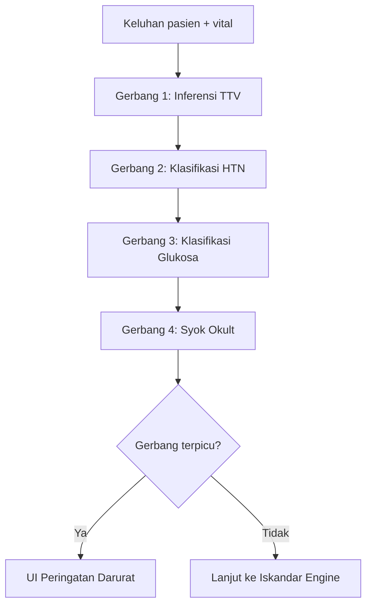

# Emergency Detector

Emergency detector adalah protokol keamanan empat-gerbang yang berjalan sebelum
Iskandar Diagnosis Engine. Tugasnya adalah menangkap kondisi yang mengancam jiwa
sejak dini dan memaksa perhatian klinis segera. Setiap gerbang yang memicu
peringatan memutus alur diagnostik normal dan menampilkan peringatan tingkat
darurat di antarmuka.

## Tujuan

Layanan kesehatan primer di Indonesia melihat spektrum akuitas yang luas.
Emergency detector menyediakan layar pre-diagnosis yang cepat dan deterministik
yang memeriksa pola yang memerlukan tindakan segera: tanda vital abnormal,
krisis hipertensi, kegawatdaruratan glukosa, dan syok okult. Berjalan sepenuhnya
di peramban tanpa dependensi API.

## Tata letak direktori

```
lib/emergency-detector/
├── ttv-inference.ts           # Gerbang 1: Inferensi vital yang hilang dari keluhan
├── htn-classifier.ts          # Gerbang 2: Klasifikasi HTN dan manajemen krisis
├── glucose-classifier.ts      # Gerbang 3: Deteksi krisis glukosa (DKA/HHS, hipoglikemia)
├── occult-shock-detector.ts   # Gerbang 4: Deteksi hipotensi relatif dan syok
├── gate-registry.ts           # ID gerbang klinis untuk pencocokan pola v2
├── pattern-engine.ts          # Mesin pencocokan pola untuk sinyal gejala
├── clinical-snapshot.ts       # Pembangun snapshot untuk konteks darurat
├── action-protocols.ts        # Tindakan yang direkomendasikan per gerbang
├── index.ts                   # Ekspor publik
└── *.test.ts                  # Pengujian unit untuk setiap gerbang
```

## Abstraksi kunci

### `VitalSigns`

Nadi, frekuensi pernapasan, suhu, tekanan darah sistolik, dan tekanan darah
diastolik. Dapat diukur atau diinferensi.

### `HTNClassification`

Tipe (`NORMAL` hingga `HTN_EMERGENCY`), tingkat keparahan, tekanan darah final,
dan rekomendasi. Menggunakan ambang batas FKTP 2024.

### `GlucoseClassification`

Kategori (`HYPOGLYCEMIA_CRISIS` hingga `HYPERGLYCEMIA_CRISIS`), tingkat
keparahan, dan rekomendasi yang selaras dengan PERKENI 2024.

### `OccultShockResult`

Tingkat risiko (`CRITICAL` | `HIGH` | `MODERATE` | `LOW`), pemicu, dan
perbandingan dengan baseline.

## Cara kerja

### Alur gerbang



### Gerbang 1: Inferensi TTV dari keluhan

`lib/emergency-detector/ttv-inference.ts`

Ketika tanda vital hilang, gerbang menginferensinya dari keluhan utama pasien.
Menggunakan pola gejala berbasis bukti yang berasal dari panduan WHO dan AHA.
Misalnya, keluhan "sesak napas" memicu takipnea terinferensi (RR 24-30) dan
takikardia terinferensi (HR 90-110). Nilai terinferensi membawa metadata tentang
kepercayaan dan penalaran, dan tidak pernah disajikan sebagai terukur.

Gerbang juga memeriksa apakah tanda vital yang terukur atau terinferensi berada
di luar rentang normal. Abnormalitas ditandai tetapi tidak sendiri memicu
darurat — mereka memberi makan ke gerbang hilir.

### Gerbang 2: Klasifikasi krisis HTN (8 tipe per FKTP 2024)

`lib/emergency-detector/htn-classifier.ts`

Mengklasifikasikan tekanan darah ke dalam delapan tipe:

- `NORMAL` — saran gaya hidup
- `PREHYPERTENSION` — modifikasi gaya hidup, periksa ulang dalam 3-6 bulan
- `PRIMARY_HTN` — farmakoterapi per algoritma FKTP
- `ISOLATED_SYSTOLIC_HTN` — umum pada lansia, pemantauan hati-hati
- `WHITE_COAT_HTN` / `MASKED_HTN` — interpretasi tekanan darah kontekstual
- `RESISTANT_HTN` — konfirmasi kepatuhan, atasi penyebab sekunder
- `HTN_URGENCY` — BP >= 180/110 tanpa HMOD; protokol Captopril SL
- `HTN_EMERGENCY` — BP >= 180/110 dengan HMOD; rujukan segera

Gerbang menggunakan protokol pengukuran tekanan darah terstruktur (3-4
pembacaan, rata-rata 2 terakhir) dan memeriksa bendera merah HMOD: nyeri dada,
edema paru, defisit neurologis, perubahan penglihatan, sakit kepala berat,
oliguria, dan gangguan kesadaran.

Protokol Captopril SL tertanam: 12.5mg sublingual sekarang, pantau setiap 15
menit, ulangi hanya jika DBP > 100 pada 30 menit, lalu Amlodipine 10mg PO pada
60 menit.

### Gerbang 3: Krisis glukosa (deteksi DKA/HHS, timer 15-15)

`lib/emergency-detector/glucose-classifier.ts`

Menyaring pengukuran glukosa terhadap ambang batas PERKENI 2024 dan ADA 2026:

- **Krisis hipoglikemia** — glukosa < 70 mg/dL. Memicu aturan 15-15: 15g
  karbohidrat cepat, periksa ulang dalam 15 menit, ulangi hingga 3 siklus.
- **Prediabetes** — GDPT 100-125, TGT 140-199, HbA1c 5.7-6.4. Intervensi gaya
  hidup intensif.
- **Diabetes terkonfirmasi** — GDS >= 200 + gejala klasik, GDP >= 126, TTGO >=
  200, atau HbA1c >= 6.5.
- **Krisis hiperglikemia** — DKA/HHS dicurigai dengan tanda krisis (pernapasan
  Kussmaul, bau aseton, gangguan kesadaran, dehidrasi berat). Rujukan ICU
  segera.

Gerbang juga menyediakan kriteria skrining DM berdasarkan faktor risiko (BMI >=
23, riwayat keluarga, CVD, hipertensi, dll.).

### Gerbang 4: Detektor syok okult

`lib/emergency-detector/occult-shock-detector.ts`

Mendeteksi hipotensi relatif pada pasien dengan hipertensi yang diketahui yang
datang dengan gejala akut. Algoritmanya:

1. Memeriksa hipoglikemia terlebih dahulu (dapat meniru syok)
2. Menghitung tekanan darah baseline dari 3 kunjungan klinik terakhir
   menggunakan median
3. Menghitung MAP = DBP + 1/3(SBP - DBP)
4. Memeriksa pemicu bahaya:
   - Hipotensi absolut: SBP < 90 atau MAP < 65
   - Hipotensi relatif: delta SBP >= 40 dari baseline
5. Menghasilkan rekomendasi berdasarkan tingkat risiko dan gejala akut

Gerbang mencakup daftar periksa penilaian perfusi (status mental, suhu kulit,
isi ulang kapiler, output urin) dan alur kerja prioritas terintegrasi yang
mengarahkan ke gerbang yang benar berdasarkan temuan paling kritis.

### Alur kerja prioritas terintegrasi

`integratedTTVWorkflow()` dalam `occult-shock-detector.ts` menetapkan urutan
prioritas:

1. Hipoglikemia (< 70) — tangani terlebih dahulu
2. Syok okult (HTN + gejala) — selidiki
3. Krisis HTN (>= 180/120) — triase
4. Krisis hiperglikemia (>= 200 + tanda krisis) — rujuk
5. Klasifikasi standar

## Titik masuk untuk modifikasi

| Tujuan                                           | File                                              | Catatan                                                                         |
| ------------------------------------------------ | ------------------------------------------------- | ------------------------------------------------------------------------------- |
| Menambahkan pola gejala baru untuk inferensi TTV | `lib/emergency-detector/ttv-inference.ts`         | Tambahkan ke `SYMPTOM_PATTERNS` dengan kata kunci, rentang vital, dan penalaran |
| Mengubah ambang batas BP                         | `lib/emergency-detector/htn-classifier.ts`        | Perbarui konstanta `BP_THRESHOLDS`                                              |
| Mengubah ambang batas glukosa                    | `lib/emergency-detector/glucose-classifier.ts`    | Perbarui konstanta `GLUCOSE_THRESHOLDS`                                         |
| Mengubah ambang batas syok                       | `lib/emergency-detector/occult-shock-detector.ts` | Perbarui konstanta `SHOCK_THRESHOLDS`                                           |
| Menambahkan gerbang klinis baru                  | `lib/emergency-detector/gate-registry.ts`         | Tambahkan ID gerbang, lalu implementasikan dalam mesin pola                     |

## File kunci

- **`lib/emergency-detector/ttv-inference.ts`** — Gerbang 1. Menginferensi vital
  yang hilang dari keluhan menggunakan pola berbasis bukti. Rentang normal dari
  WHO/AHA.
- **`lib/emergency-detector/htn-classifier.ts`** — Gerbang 2. Klasifikasi HTN
  delapan tipe dengan protokol Captopril SL dan triase bendera merah HMOD.
- **`lib/emergency-detector/glucose-classifier.ts`** — Gerbang 3. Deteksi krisis
  glukosa dengan aturan 15-15 dan skrining DKA/HHS.
- **`lib/emergency-detector/occult-shock-detector.ts`** — Gerbang 4. Deteksi
  hipotensi relatif dengan perbandingan baseline dan penilaian perfusi.
- **`lib/emergency-detector/gate-registry.ts`** — ID gerbang untuk mesin
  pencocokan pola v2. Gerbang yang ada tetap tidak tersentuh.

## Halaman terkait

- [Iskandar Diagnosis Engine](iskandar-diagnosis-engine.md) — CDSS utama yang
  berjalan setelah emergency detector
- [Dashboard Bridge](dashboard-bridge.md) — Mesin kanonik yang dapat menyediakan
  penilaian darurat tambahan (NEWS2)
