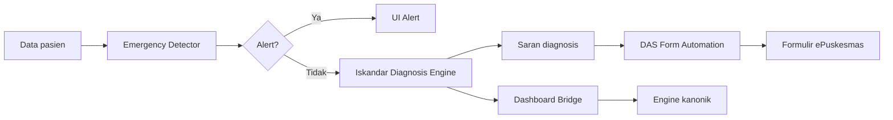

# Sistem Sentra Assist

Sentra Assist dibangun围绕 lima sistem inti yang bekerja sama untuk menyediakan
clinical decision support di dalam lingkungan peramban ePuskesmas. Setiap sistem
memiliki satu tanggung jawab dan berkomunikasi melalui antarmuka yang
terdefinisi dengan baik.

## Lima sistem

### Iskandar Diagnosis Engine

Pipeline CDSS deterministik-pertama yang mengubah keluhan pasien menjadi saran
diagnosis terurut. Ia berjalan sepenuhnya di peramban, dapat beroperasi offline,
dan selalu menganonimkan data sebelum diproses. Lihat
[Iskandar Diagnosis Engine](iskandar-diagnosis-engine.md).

### Emergency Detector

Protokol keselamatan empat-gerbang yang berjalan sebelum diagnosis engine. Ia
memeriksa pola yang mengancam jiwa pada tanda vital, tekanan darah, glukosa, dan
syok okultisme. Gerbang mana pun yang memicu alert akan memotong jalur normal
dan memaksa perhatian klinis segera. Lihat
[Emergency Detector](emergency-detector.md).

### DAS Form Automation

Data Ascension System men-scrape halaman ePuskesmas, memetakan kolom formulir ke
payload klinis, dan mengisi otomatis. Ia mempelajari pola per-fasilitas dan
menyimpan cache pemetaan yang berhasil agar kunjungan berulang menjadi lebih
cepat. Lihat [DAS Form Automation](das-form-automation.md).

### Dashboard Bridge

Menangani autentikasi, sinkronisasi pasien, dan integrasi dengan Sentra
Dashboard canonical clinical engine. Ia melakukan polling terhadap bridge API
untuk transfer yang tertunda dan dapat mengirim konsultasi kembali ke dokter
online. Lihat [Dashboard Bridge](dashboard-bridge.md).

## Bagaimana mereka bekerja bersama

Data pasien masuk melalui sidepanel atau kolom ePuskesmas yang di-scrape.
Emergency detector berjalan terlebih dahulu. Jika tidak ditemukan
kegawatdaruratan, Iskandar Diagnosis Engine menghasilkan saran. DAS kemudian
mendorong saran tersebut ke kolom formulir ePuskesmas yang tepat. Dashboard
Bridge secara opsional memperkaya diagnosis dengan engine kanonik sisi server
dan menangani transfer data pasien dua arah.

## Infrastruktur bersama

Seluruh sistem bergantung pada:

- **PII Guard** (`lib/api/pii-guard.ts`) — hashing SHA-256 dan anonimisasi
  fail-closed.
- **Audit Service** (`lib/api/audit-service.ts`) — log append-only dengan rantai
  kriptografis.
- **Feature Flags** (`lib/iskandar-diagnosis-engine/feature-flags.ts`) —
  pengelolaan modul berbasis variabel lingkungan.

## Titik masuk untuk modifikasi

| Jika Anda ingin...                         | Mulai dari sini                                                           |
| ------------------------------------------ | ------------------------------------------------------------------------- |
| Menambahkan penyakit baru ke KB            | `lib/iskandar-diagnosis-engine/symptom-matcher.ts` + `data/penyakit.json` |
| Mengubah ambang darurat                    | `lib/emergency-detector/ttv-inference.ts`                                 |
| Menambahkan kolom formulir ePuskesmas baru | `lib/scraper/adaptive/field-classifier.ts`                                |
| Mengubah endpoint bridge API               | `lib/api/bridge-client.ts`                                                |
| Menambahkan feature flag baru              | `lib/iskandar-diagnosis-engine/feature-flags.ts`                          |
