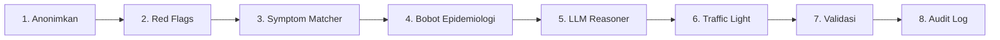

# Iskandar Diagnosis Engine

Iskandar Diagnosis Engine adalah pipeline CDSS inti dari Sentra Assist. Ia
deterministik-pertama, berjalan sepenuhnya di peramban, dan dapat beroperasi
offline. Engine menerima data pasien yang sudah dianonimkan dan menghasilkan
saran diagnosis terurut beserta penalaran klinis, alert keselamatan, dan kode
ICD-10.

## Tujuan

Engine ini menggantikan emergency-only detector lama dengan CDSS penuh 159
penyakit. Dirancang untuk layanan primer Indonesia (FKTP) dan mengikuti model
tata kelola yang ketat: **anonimkan terlebih dahulu, deteksi darurat, cocokkan
gejala, perkaya dengan LLM, validasi, lalu audit**. Setiap langkah bersifat
fail-closed dan setiap keluaran menyertakan disclaimer.

## Layout direktori

```
lib/iskandar-diagnosis-engine/
├── engine.ts                          # Orkestrator utama — pipeline 8-langkah
├── get-suggestions-flow.ts            # Titik masuk dari sidepanel / bridge
├── diagnosis-algorithm.ts             # Confidence scoring dan pemeringkatan
├── symptom-matcher.ts                 # Deterministic KB matching (IDF + Coverage + Jaccard)
├── llm-reasoner.ts                    # Constrained LLM enrichment dengan fallback KB
├── traffic-light.ts                   # Gerbang keselamatan 8-aturan (escalation-only)
├── epidemiology-weights.ts            # Bayesian prior dari 45.030 kasus nyata
├── feature-flags.ts                   # Env-var-driven module gating
├── diagnosis-v2.ts                    # Shadow mode untuk engine V2
├── anonymizer.ts                      # PII stripping dan validasi
├── audit-logger.ts                    # Per-session audit trail
├── red-flags.ts                       # Aturan darurat hardcoded
├── validation/                        # Pipeline verifikasi ICD-10
│   └── index.ts
├── clinical-reasoning-*.ts            # Subsistem penalaran (differential, therapy, evidence)
├── pharmacotherapy-reasoner.ts        # Rekomendasi obat
├── chronic-disease-classifier.ts      # Deteksi penyakit kronis
├── trajectory-*.ts                    # Riwayat kunjungan dan analisis trajectory
└── index.ts                           # Export publik
```

## Abstraksi kunci

### `CDSSEngineResult`

Keluaran akhir dari pipeline. Berisi saran yang sudah divalidasi, red flags,
alert, waktu pemrosesan, dan atribusi sumber.

### `MatchedCandidate`

Penyakit dari KB dengan skor kecocokan, gejala yang cocok, dan metadata klinis
(red flags, terapi, kriteria rujukan).

### `TrafficLightLevel`

`GREEN` | `YELLOW` | `RED`. Ditentukan oleh gerbang keselamatan 8-aturan.
Bersifat escalation-only: ketika sebuah aturan terpicu, level hanya dapat naik.

### `ConfidenceBand`

`very_high` (>= 85) | `high` (>= 70) | `moderate` (>= 50) | `low` (< 50).
Digunakan oleh algoritma diagnosis untuk melakukan tier tampilan.

## Cara kerja

### Pipeline 8-langkah



#### Langkah 1: Anonimkan (tidak pernah dilewati)

`anonymize()` menghapus PII dari encounter sebelum pemrosesan apa pun.
`validateAnonymization()` menjalankan pemeriksaan fail-closed. Jika PII lolos,
engine langsung melemparkan error dan tidak mengembalikan saran.

#### Langkah 2: Pemeriksaan red flag (pertama, tanpa dependensi API)

`runRedFlagChecksFromContext()` menjalankan aturan darurat hardcoded terhadap
konteks yang sudah dianonimkan. Aturan ini mendeteksi pola seperti nyeri dada
dengan hipotensi, perubahan status mental, atau dehidrasi berat. Jika red flag
ditemukan, ia menjadi alert tetapi tidak menghentikan pipeline — engine tetap
menghasilkan saran sambil menonjolkan kegawatdaruratan.

#### Langkah 3: Symptom matcher (deterministik, <100ms)

`matchSymptoms()` menilai keluhan pasien terhadap knowledge base 159 penyakit
menggunakan kombinasi terbobot dari IDF, coverage, dan Jaccard similarity.
Formulanya:

```
combined = idfScore * 0.5 + coverageScore * 0.3 + jaccardScore * 0.2
```

KB dimuat dari `data/penyakit.json` dan di-cache di memori. Tidak ada panggilan
API.

#### Langkah 4: Bobot epidemiologi (Bayesian prior)

`applyEpidemiologyWeights()` menyesuaikan skor kecocokan berdasarkan prevalensi
penyakit lokal dari 45.030 kasus nyata. Bobot dibatasi maksimum 1.35 untuk
mencegah peningkatan berlebihan. Penyakit spesifik gender mendapatkan tambahan
+0.05 ketika gender pasien sesuai dengan gender dominan dalam data.

#### Langkah 5: LLM reasoner (constrained enrichment)

`runLLMReasoning()` mengirimkan kandidat KB teratas ke LLM dengan system prompt
yang ketat: **hanya merangking dan memperkaya dari kandidat yang diberikan,
tidak pernah menciptakan diagnosis baru**. LLM mengembalikan penalaran, red
flags, dan tindakan yang disarankan dalam Bahasa Indonesia.

Jika LLM tidak tersedia, engine melakukan fallback ke hasil KB saja. Jika
kandidat KB teratas memiliki skor kecocokan di atas `SENTRA_LLM_SKIP_THRESHOLD`
(default 0.65) dan pasien tidak memiliki penyakit kronis, panggilan LLM dilewati
entirely untuk kecepatan.

#### Langkah 6: Traffic light (gerbang keselamatan 8-aturan)

`classifyTrafficLight()` menerapkan 8 aturan deterministik yang hanya dapat
menaikan level keselamatan:

1. **Red flags KB** — kandidat teratas memiliki red flags.
2. **Kriteria rujukan** — kandidat teratas membutuhkan rujukan.

## Mode dan safety

### Mode KB-only (default, selalu aman)

Jika `SENTRA_OPENAI_API_KEY` kosong atau panggilan LLM gagal, engine otomatis
jatuh ke mode KB-only. Mode ini adalah perilaku default yang aman dan tidak
pernah gagal karena dependensi eksternal.

### KB-first, LLM-opsional

`runLLMReasoning()` hanya memperkaya hasil KB. Ia tidak serta-merta menggantikan
hasil KB. Kontroler `feature-flags.ts` menyediakan tiga flag utama:

- `enableOpenAI` — gerbang master untuk panggilan LLM.
- `enableTrajectoryBridge` — toggle untuk SYMPHONY safety bridge.
- `enableTherapy` — toggle untuk pharmacotherapy reasoner.

### Shadow mode untuk V2

`diagnosis-v2.ts` mengimplementasikan mesin diagnosis generasi terbaru yang
berjalan dalam mode shadow: menghasilkan saran secara paralel tanpa menggantikan
output engine utama. Hal ini memungkinkan evaluasi non-regresi di produksi
sebelum aktivasi penuh.

## Integrasi dengan dashboard bridge

Ketika autentikasi bridge tersedia, workbench memanggil engine kanonik Dashboard
untuk memperkaya hasil Iskandar dengan evaluasi engine klinis kanonik sisi
server. Kline tidak menggantikan saran Iskandar; ia menambahkan informasi
seperti ranked differential, count of canonical eval, dan anamnesa extraction.
Pendekatan ini memastikan defense-in-depth: saran lokal selalu tersedia meskipun
server tidak dapat dijangkau.

## Audit dan observabilitas

Setiap pemanggilan engine menghasilkan entri dalam `audit-logger.ts`. Entri
mencakup:

- Payload teranonimkan (PII di-strip)
- Skor kecocokan per kandidat KB
- Hasil LLM (jika dijalankan)
- Level traffic light akhir
- Disposisi saran

Log disimpan secara append-only dan dapat ditelusuri per sesi untuk kebutuhan
governance.

## Halaman terkait

- [Deteksi darurat](emergency-detector.md) — protokol keselamatan yang berjalan
  sebelum engine ini.
- [Dashboard Bridge](dashboard-bridge.md) — bagaimana engine kanonik sisi server
  memperkaya saran ini.
- [Clinical Safety](../features/clinical-safety.md) — lapisan keselamatan
  tambahan yang membungkus output engine.
- [Arsitektur Sentra Assist](../overview/architecture.md) — tempat engine dalam
  arsitektur keseluruhan.
